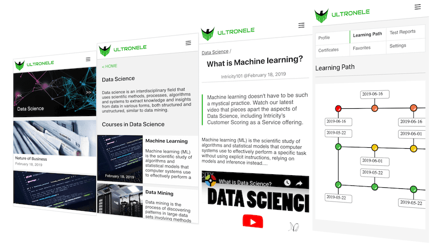

<!-- AUTO-GENERATED-CONTENT:START (STARTER) -->
<p align="center">
  <a href="https://www.gatsbyjs.org">
    
  </a>
</p>
<h1 align="center">
  The world’s fastest LMS engine
</h1>

This is a gatsby starter project used to generate a LMS(learning management system) skeleton site.

Logo image is designed in [designevo](https://www.designevo.com/)@2019/01/27


## Screen Shots



## Demo

is [HERE!](https://ultronele.netlify.com/)


## Features

* extremely fluent visit experience
* fast setup and easy depolyment procedure
* gamefication learning experience
* category/tutorial/quiz generation by cli easily
* learning process tracking and visualization
* quiz report and certificate generation
* user locally login/cache support
* mobile screen support


## Prerequisite tools

* node
* npm
* gatsby


## Important 3rd part library used

* [konva](https://konvajs.org/) to draw certificate 
* [react-confetti](https://github.com/alampros/react-confetti) to open bonus
* [downloadjs](http://danml.com/download.html) to convert dataURL to image file
* [plop](https://github.com/amwmedia/plop) to generate content by cli


## 🚀 Quick start

Just for a couple of commands, you will have your own LMS, here we go:

> $ gatsby new my-ultronele https://github.com/runbytech/ultron-ele

> $ cd my-ultronele

> $ npm i

> $ gatsby develop

Your site is now running at http://localhost:8000


## 🎓 Learning Gatsby

Looking for more guidance? Full documentation for UltronEle lives [on the website](https://ultronele.netlify.com/userguide). 


## 💫 Quick Deploy

```
Prerequisites: github account and netlify account required
```

[](https://app.netlify.com/start/deploy?repository=https://github.com/runbytech/ultron-ele)

<!-- AUTO-GENERATED-CONTENT:END -->
